[TensorFlow] GANomaly
=====

TensorFlow implementation of GANomaly with MNIST dataset.  
<a href="https://github.com/YeongHyeon/GANomaly-PyTorch">PyTorch Version</a> is also implemented.

## Summary

### GANomaly architecture

    
  
Simplified GANomaly architecture.

### Graph in TensorBoard

  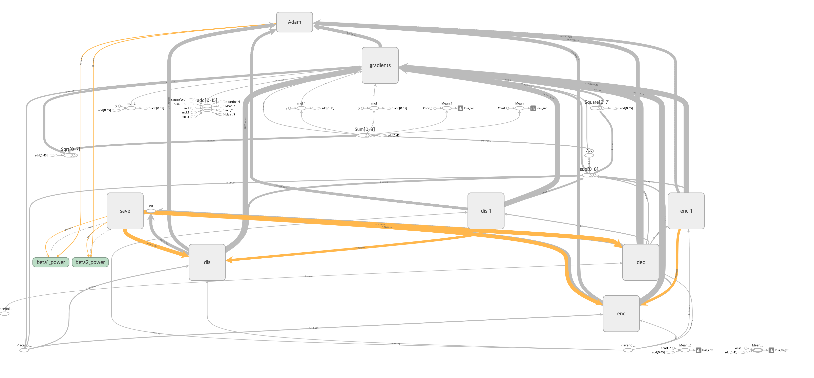  
  
Graph of GANomaly.

### Problem Definition

  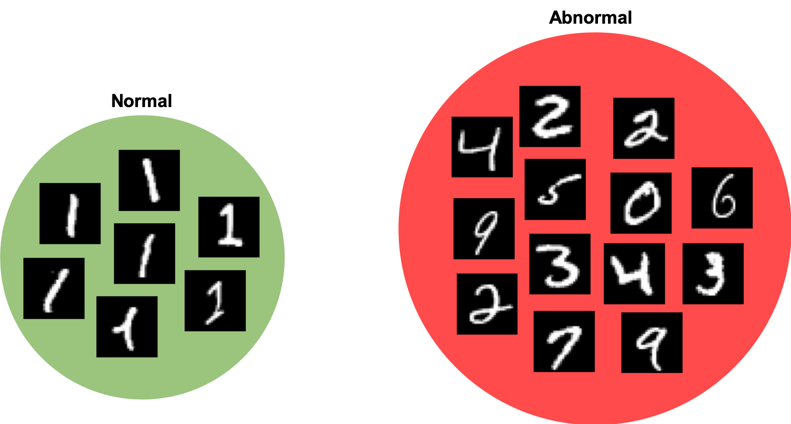  
  
'Class-1' is defined as normal and the others are defined as abnormal.

## Results

### Training Procedure

  

    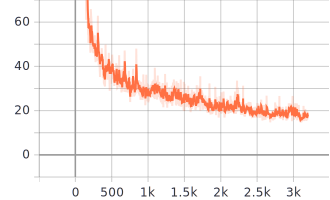
    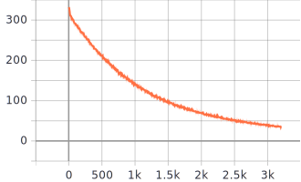
     
    
    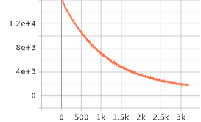
  

  
Loss graph in the training procedure.   Each graph shows encoding loss, reconstruction loss, adversarial loss, and total (target) loss respectively.

  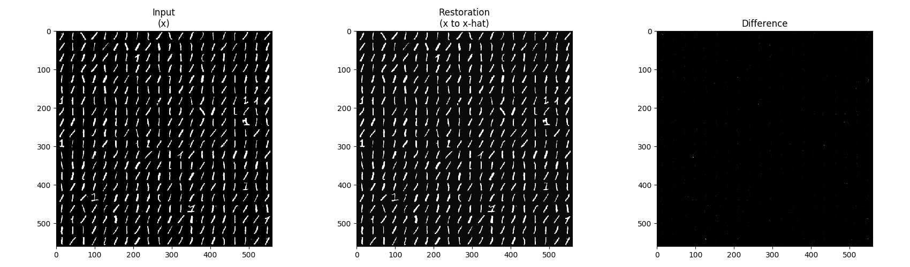  
  
Restoration result by GANomaly.

### Test Procedure

  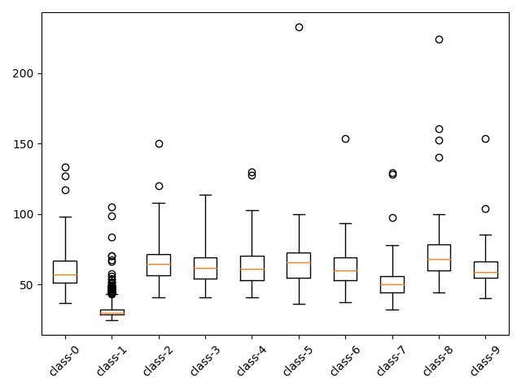
  
Box plot with encoding loss of test procedure.

  

    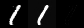
    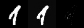
    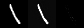
  

  
Normal samples classified as normal.

  

    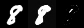
    
    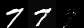
  

  
Abnormal samples classified as normal.

  

    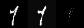
    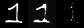
    
  

  
Normal samples classified as abnormal.

  

    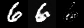
    
    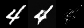
  

  
Abnormal samples classified as abnormal.

## Environment
* Python 3.7.4  
* Tensorflow 1.14.0  
* Numpy 1.17.1  
* Matplotlib 3.1.1  
* Scikit Learn (sklearn) 0.21.3  

## Reference
[1] S Akcay, et al. (2018). <a href="https://arxiv.org/abs/1805.06725">Ganomaly: Semi-supervised anomaly detection via adversarial training.</a>. arXiv preprint arXiv:1805.06725.
